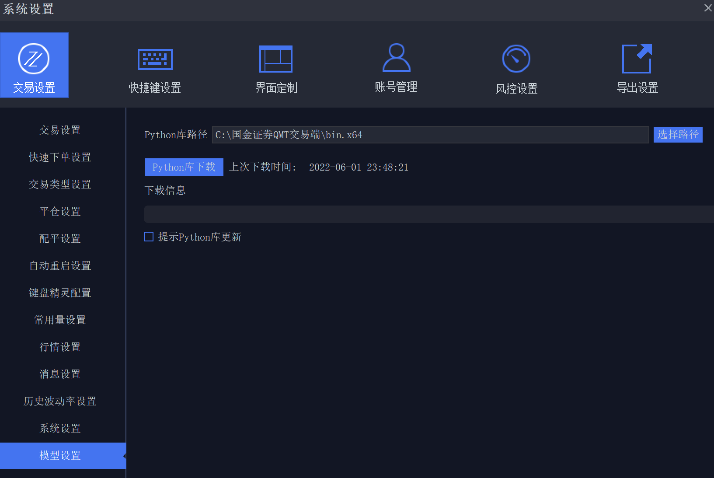
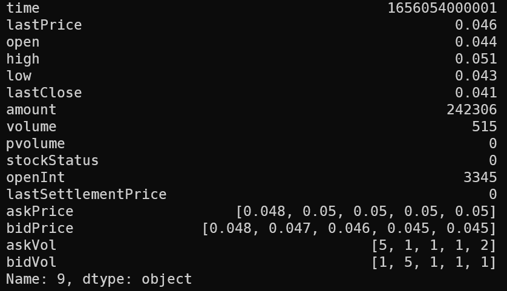

# XtQuant
迅投QMT接口相关介绍和常用功能封装

## xtquant介绍

**迅投QMT极速策略交易系统** 是一款专门针对券商、期货公司、信托等机构的高净值客户开发设计的集行情显示，投资研究，产品交易于一身，并自备完整风控系统的综合性平台。其自带投研量化平台可以灵活实现CTA，无风险套利等多种量化策略，并能够对策略进行回测检验和自动化交易。目前大部分券商都有支持策略交易，目前已知的像国金、国盛、国信、海通、华鑫等券商均有对普通用户开放，在开通资金门槛、功能阉割和佣金费率方面可能有一些差异，目前部分券商股票佣金可低至万1，可极大降低量化交易摩擦成本。


`xtquant`是`QMT`官方内置的`XtMiniQmt`极简客户端对应的Python接口，目前支持的版本为3.6~3.8，可支持历史行情下载、实时数据订阅、外部数据访问、普通账户和两融账户交易(需开通相关权限)，对量化交易支持的比较完善，跟极速策略交易系统相比最主要的优势是简洁、灵活，不局限在bar、kline的事件触发，可以容易地集成多种数据源进行综合分析。相关文档可在仓库[文档](xtquant/doc)中详细阅读。

`QMT`内置的Python版本为3.6，第一次使用的话需手动下载相关的库，或直接拷贝已经下载好的`xtquant`库。





`XtMiniQmt.exe`存在于QMT安装目录下的`bin.x64`子目录中, `xtquant`库默认安装在`bin.x64\Lib\site-packages`中。

内置的Python版本较老，对于一些较新的库支持有限，因此，如果我们想在自定义的`Python`中调用，如`Python3.8`，只需将`xtquant`拷贝到我们自己python安装目录的`Lib\site-packages`中便可，这里我的安装路径是 C:\ProgramData\Anaconda3\Lib\site-packages\xtquant。

`xtquant`主要包含两大块：
- **xtdata**：`xtdata`提供和`MiniQmt`的交互接口，本质是和`MiniQmt`建立连接，由`MiniQmt`处理行情数据请求，再把结果回传返回到`python`层。需要注意的是这个模块的使用目前并不需要登录，因此只要安装了`QMT`,就可以无门槛的使用其提供的数据服务。
- **xttrader**：`xttrader`是基于迅投`MiniQMT`衍生出来的一套完善的Python策略运行框架，对外以Python库的形式提供策略交易所需要的交易相关的API接口。该接口需开通A股实盘版权限方可使用。

在运行使用`XtQuant`的程序前需要先启动`MiniQMT`客户端。通常有两种方式，一种是直接启动极简QMT客户端`XtMiniQmt.exe`


如果登录时提示没有相关权限，可尝试启动QMT量化交易终端`XtItClient.exe`,在登录界面选择极简模式


## 行情接口分析

QMT行情有两套不同的处理逻辑：
- 数据查询接口：使用时需要先确保MiniQmt已有所需要的数据，如果不足可以通过补充数据接口补充，再调用数据获取接口获取。适用于少量的实时行情数据和大批量的历史行情数据。
- 订阅接口：直接设置数据回调，数据到来时会由回调返回。订阅接收到的数据一般会保存下来，同种数据不需要再单独补充。适用于大批量的实时行情数据。

按照类别，主要有以下四类：
- 行情数据（K线数据、分笔数据，订阅和主动获取的接口）
- 财务数据
- 合约基础信息
- 基础行情数据板块分类信息等基础信息

### 行情接口概况

首先导入行情库：
``` python
from xtquant import xtdata
print(dir(xtdata))
```
可以看到行情主要分为以下几个模块：
- 实时行情订阅：subscribe* 系列
- 基本信息和行情查询：get_* 系列
- 历史数据订阅： download_* 系列 
- 历史数据处理： get_local_data

针对数据存储目录，默认为`xtdata.data_dir=../userdata_mini/datadir`, 按照官方文档的说明似乎可以任意设置，但实操下来却发现没起到作用。因此，如果默认存储空间有限的话，我们可以将其移动到有较大空间的地方，然后创建一个快捷方式指向原来的地方，避免磁盘空间被耗尽。

### 实战：历史行情数据下载

QMT提供的历史行情下载接口有两个：
- 单支股票下载：download_history_data(stock_code, period, start_time='', end_time='')
- 批量股票下载：download_history_data2(stock_list, period, start_time='', end_time='',callback=None)

其中各个参数具体含义如下：
- stock_code：股票名，以`code.exchange`的形式表示，exchange可从如下品种中选择
    - 上海证券(SH), 如`510050.SH`
    - 深圳证券(SZ), 如`159919.SZ`
    - 上海期权(SHO), 如`10004268.SHO`
    - 深圳期权(SZO), 如`90000967.SZO`
    - 中国金融期货(CFFEX), 如`IC07.CFFEX`
    - 郑州商品期货(CZCE), 如`SR05.CZCE`
    - 大连商品期货(DCE), 如`m2212.DCE`
    - 上海期货(SHFE), 如`wr2209.SHFE`
    - 能源中心(INE), 如`sc00.INE`
    - 香港联交所(HK), 如`00700.HK`
- stock_list, 股票列表，如['510050.SH', '159919.SZ']
- period, 数据周期，可选`1m`、`5m`、`1d`、`tick`, 分别表示1分钟K线、5分钟K线、1天K线、分笔数据
- start_time, 数据起始时间，格式YYYYMMDD/YYYYMMDDhhmmss/YYYYMMDDhhmmss.milli，如 "20200427" "20200427093000" "20200427093000.000"
- end_time，数据结束时间，格式同start_time

如果运行如下代码，下载深圳市场300ETF期权`沪深300ETF购9月4900`标的的tick行情，就会在`userdata_mini\datadir\SZO\0\90000967`目录下生成以日为单位的tick数据：

``` python
import pandas as pd
from xtquant import xtdata

xtdata.download_history_data('90000967.SZO', period='tick')
data = xtdata.get_local_data(field_list=[], stock_code=['90000967.SZO'], period='tick', count=10)

df = pd.DataFrame(data['90000967.SZO'])
print(df.iloc[-1])

```


上述二进制文件是无法直接读取的，这里通过`get_local_data`接口进行数据文件的解析，便可解码已经下载的上述tick行情，包含Unix时间戳、K线、买五卖五快照信息等：



注意到这里的Unix时间戳是精确到毫秒的，可以通过datetime转换成字符型：
``` Python
import datetime
df['datetime'] = df['time'].apply(lambda x: datetime.datetime.fromtimestamp(x / 1000.0))
print(df)
```


### 实战：历史行情转存数据库

1、板块内股票批量下载

2、Clickhouse数据库设计

3、Clickhouse数据批量写入

### 实战：实时行情订阅


未完待续......
---

欢迎关注我的公众号“**量化实战**”，原创技术文章第一时间推送。


